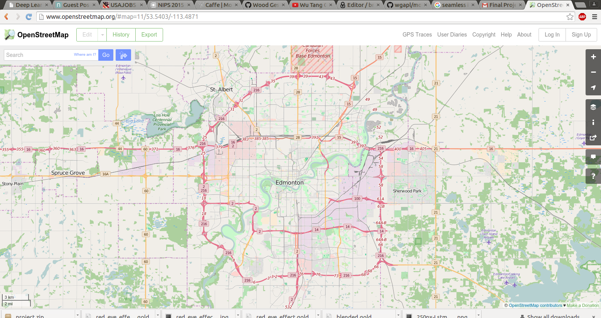

#mongodb_osm
<center></center>


To run against the example dataset type in the terminal:

   ```
cd edmonton_results
python ./submission.py
```

To see further options, type:

   `python ./submission.py -h`

The results of running the submission.py script on data from the
entire Edmonton region of the Open Street Map can be found in the
directory:
```
 ./edmonton_results
   |
   |--- edmonton_size_result.json
   |
   |--- edmonton_uid_result.json
   |
   |--- edmonton_nodes_ways_result.json
   |
   |--- edmonton_amenity_result.json
   |__

```
Running submission.py will save similar JSON results for the example
dataset.

Thank you for critiquing my Final Project, and have a wonderful day.
